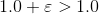
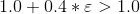
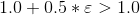

# 机器精度

在开始计算之前，了解自己的机器的绝对精度是必要的。不同的系统、
不同的硬件可能导致机器精度的差异。好在 C++ 专门提供了 limit 库解决这一问题。

比如 numeric_limits<double>::epsilon() 这个模板函数提供了 double
型变量的 machine epsilon，它的严格定义是在双精度浮点下，满足

为真的最小正数 epsilon。因此当计算相对误差时，
它就是可以达到的最小精度分辨率。这里考虑一下，

是真还是假？

呢？

结果参见目录下的程序。自己考虑原因，提示一下，对 epsilon 级别数，

和

有区别么？机器能区分么？想明白这个事情，
你对浮点数的本质以及精度就有了较深刻的理解。

limits 模板库里提供了大量和具体机器精度有关的参数，
参见：[cplusplus.com](http://www.cplusplus.com/reference/limits/numeric_limits/)

[返回](../README.md)